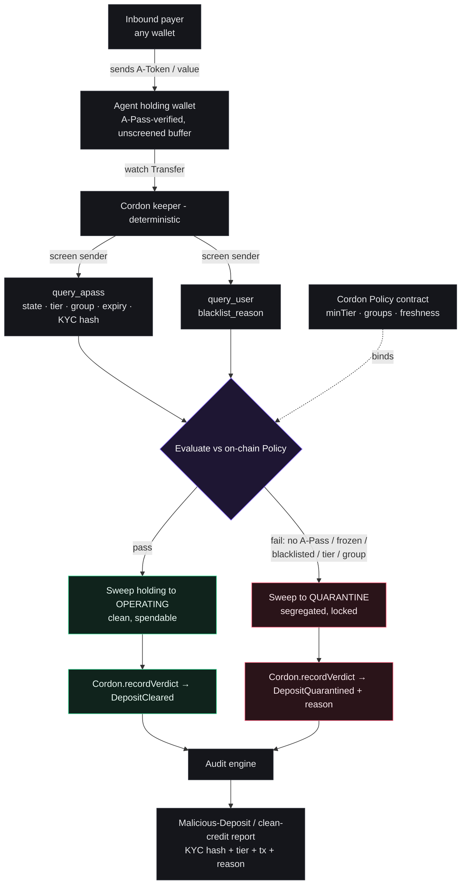

# Cordon

> **A firewall for the money your AI agent receives.**

Cordon is the **inbound compliance firewall** for autonomous agent wallets. Every payment an agent *receives* is screened against the institution's on-chain risk policy — sender identity, tier, jurisdiction, freshness, blacklist — **before** it can touch spendable balance. Funds that fail are quarantined and never enter operating capital, and every screen (cleared or quarantined) produces a regulator-ready, selective-disclosure audit record.

Built for the **Cleanverse Build: Verified Finance Hackathon** (Track 02 — Trusted AI Agent Transactions), live on **Monad**.


---

## Live

| | |
|---|---|
| **CordonPolicy** (Monad Testnet, chain `10143`) | [`0x244198CFA8660BE9B47961E3C061DFA90622d2B0`](https://testnet.monadvision.com/address/0x244198CFA8660BE9B47961E3C061DFA90622d2B0) |
| Initial on-chain policy | `minTier=1` · `freshnessWindow=30d` · `requireCleanBlacklist=true` |
| Example verdicts | `DepositCleared` `0x4680a71e…` · `DepositQuarantined(TierTooLow)` `0x895bf983…` |
| Live app | **https://cordon-web-production.up.railway.app** |

---

## The problem

On a fast, near-free chain like Monad, anyone can dust an agent's public wallet with value from a sanctioned, mixer-linked, or simply non-compliant counterparty. The agent folds it into operating balance, spends it on the next procurement, and the **whole treasury is contaminated** — triggering automated compliance freezes across the institution's network.

A binary *verified / not-verified* check clears counterparties that are technically verified but still outside an institution's risk appetite: low tier, wrong jurisdiction, near-expiry credential, freshly blacklisted.

## The solution

Agent-payment safety has two sides — controlling what an agent **spends** (outbound) and verifying what it's **paid** (inbound). Cordon is the inbound side.

- **Screen-on-credit.** Inbound value lands in a holding wallet, is screened against on-chain policy, then routed to *operating* (clean, spendable) or *quarantine* (segregated, never spent). You cannot block a push transfer in the mempool — Cordon screens on credit and never claims interception.
- **On-chain verdict log.** Every screen emits a structured `DepositCleared` / `DepositQuarantined` event — the immutable audit anchor. Duplicate `depositId`s revert.
- **Selective disclosure.** An `attestationHash = keccak(cvRecordId · KYC hash · tier · status · screenedAt)` proves the sender's verified status without putting PII on-chain.

## How it works — the keeper (deterministic, no LLM in the money path)

```
WATCH    inbound A-Token Transfer to the holding wallet
SCREEN   query_apass(sender) + query_user(sender)
EVALUATE vs on-chain Policy — status active · tier ≥ minTier · not near expiry · group allowed · blacklist clean
ROUTE    pass → holding→operating · fail → holding→quarantine
RECORD   CordonPolicy.recordVerdict → DepositCleared | DepositQuarantined(reason)
```

`reason` enum: `NoAPass · Frozen · Blacklisted · TierTooLow · GroupNotAllowed · NearExpiry`.

## Architecture



See [docs/architecture.md](docs/architecture.md) for the custody model and the full keeper state machine.

## Cleanverse integration

Every risk signal comes from real Cleanverse primitives — Cordon is the policy layer on top of the verified signal, not a re-implementation of it.

| Primitive | Used for |
|---|---|
| `query_chain_config` | live Monad addresses (ausdc, access_core, apass) — nothing hardcoded |
| `query_apass` | tier · state · group · freshness · KYC hash |
| `query_user` | blacklist signal |
| A-Pass | the verified identity Cordon screens against policy |
| A-Token (`ausdc`) | the clean-funds rail the agent operates in |

## Monorepo

```
contracts/            Foundry — CordonPolicy.sol (policy + immutable verdict log)
packages/cleanverse/  typed REST client for the Cleanverse sandbox + Day-0 script
packages/screening/   pure policy evaluator + on-chain policy reader + attestation
packages/audit/       audit-record builder, JSON/PDF export, Supabase repository
services/keeper/      deterministic screen → record daemon (viem)
apps/web/             Next.js 16 console — policy, live stream, quarantine, audit export
docs/                 architecture
```

## Quickstart

**Prerequisites:** Node ≥ 20 + pnpm, [Foundry](https://book.getfoundry.sh/), and a Monad Testnet RPC.

```bash
# 1. Clone with Foundry submodules (forge-std, openzeppelin-contracts)
git clone --recurse-submodules <repo-url> cordon
cd cordon
# (already cloned without submodules?  git submodule update --init --recursive)

# 2. Install workspace deps
pnpm install

# 3. Contracts — build, test, coverage
forge build    --root contracts
forge test     --root contracts          # 22 tests
forge coverage --root contracts          # CordonPolicy.sol: 100% branches

# 4. Day-0 — resolve live Monad config + scaffold A-Pass test wallets
cp .env.example .env                      # fill DEPLOYER_PRIVATE_KEY (never commit .env)
pnpm day0

# 5. Web console (set apps/web/.env.local from .env.example values)
pnpm --filter web dev                     # http://localhost:3000
```

The keeper screens + records a verdict on-chain:

```bash
pnpm --filter @cordon/keeper exec tsx src/index.ts record <senderAddress> <amount> [minTierOverride]
pnpm --filter @cordon/keeper export       # write internal/exports/audit.{json,pdf}
```

## Security & privacy

- **No PII on-chain.** Verdicts carry an `attestationHash` (KYC hash + tier + state), never personal data.
- **Least privilege.** The keeper key only calls `recordVerdict`; the institution (owner) sets policy; `renounceOwnership` is disabled so the contract can't be bricked.
- **RLS.** The audit store (Supabase) is read-only under the publishable key; only the keeper's secret key writes.
- **Secrets stay out of git.** `.env`, `apps/web/.env.local`, wallet keys, and `internal/` are gitignored. The repo contains no keys.

## Status

Live: policy contract, deterministic keeper, screening SDK against the real sandbox, on-chain cleared + quarantined verdicts, audit JSON/PDF export, and the web console.
Next: real A-Token routing via the Cleanverse/Circle faucet, a vault-contract upgrade, Travel-Rule export, and per-institution policy templates.

## License

MIT — see [LICENSE](LICENSE).
