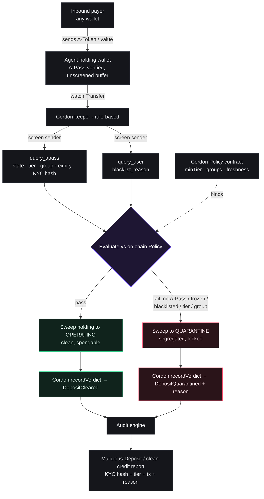

# Cordon

> **A firewall for the money your AI agent receives.**

Cordon is the **inbound compliance firewall** for autonomous agent wallets. Every payment an agent *receives* is screened against the institution's on-chain risk policy — sender identity, tier, jurisdiction, freshness, blacklist — **before** it can touch spendable balance. Funds that fail are quarantined and never enter operating capital, and every screen (cleared or quarantined) produces a regulator-ready, selective-disclosure audit record.

Built for the **Cleanverse Build: Verified Finance Hackathon** (Track 02 — Trusted AI Agent Transactions), live on **Monad**.


[](https://www.npmjs.com/package/@usecordon/screening)
[](https://www.npmjs.com/package/@usecordon/cleanverse)

---

## Live

| | |
|---|---|
| **CordonPolicy** (Monad Testnet, chain `10143`) | [`0x244198CFA8660BE9B47961E3C061DFA90622d2B0`](https://testnet.monadvision.com/address/0x244198CFA8660BE9B47961E3C061DFA90622d2B0) |
| Verified source | exact-match on [Sourcify](https://sourcify-api-monad.blockvision.org/v2/contract/10143/0x244198CFA8660BE9B47961E3C061DFA90622d2B0) — solc 0.8.24 · optimizer 200 · shanghai |
| Initial on-chain policy | `minTier=1` · `freshnessWindow=30d` · `requireCleanBlacklist=true` |
| Example verdicts | `DepositCleared` `0x4680a71e…` · `DepositQuarantined(TierTooLow)` `0x895bf983…` |
| Live app | **https://cordon-web-production.up.railway.app** |
| MCP server (remote, Streamable HTTP) | **https://cordon-mcp-production.up.railway.app/mcp** |
| SDK on npm | [`@usecordon/screening`](https://www.npmjs.com/package/@usecordon/screening) · [`@usecordon/cleanverse`](https://www.npmjs.com/package/@usecordon/cleanverse) |

---

## The problem

On a fast, near-free chain like Monad, anyone can dust an agent's public wallet with value from a sanctioned, mixer-linked, or simply non-compliant counterparty. The agent folds it into operating balance, spends it on the next procurement, and the **whole treasury is contaminated** — triggering automated compliance freezes across the institution's network.

A binary *verified / not-verified* check clears counterparties that are technically verified but still outside an institution's risk appetite: low tier, wrong jurisdiction, near-expiry credential, freshly blacklisted.

## The solution

Agent-payment safety has two sides — controlling what an agent **spends** (outbound) and verifying what it's **paid** (inbound). Cordon is the inbound side.

- **Screen-on-credit.** Inbound value lands in a holding wallet, is screened against on-chain policy, then routed to *operating* (clean, spendable) or *quarantine* (segregated, never spent). You cannot block a push transfer in the mempool — Cordon screens on credit and never claims interception.
- **On-chain verdict log.** Every screen emits a structured `DepositCleared` / `DepositQuarantined` event — the immutable audit anchor. Duplicate `depositId`s revert.
- **Selective disclosure.** An `attestationHash = keccak(cvRecordId · KYC hash · tier · status · screenedAt)` proves the sender's verified status without putting PII on-chain.

## How it works — the keeper (rule-based, no AI in the money path)

```
WATCH    inbound A-Token Transfer to the holding wallet
SCREEN   query_apass(sender) + query_user(sender)
EVALUATE vs on-chain Policy — status active · tier ≥ minTier · not near expiry · group allowed · blacklist clean
ROUTE    pass → holding→operating · fail → holding→quarantine
RECORD   CordonPolicy.recordVerdict → DepositCleared | DepositQuarantined(reason)
```

`reason` enum: `NoAPass · Frozen · Blacklisted · TierTooLow · GroupNotAllowed · NearExpiry`.

## Architecture



See [docs/architecture.md](docs/architecture.md) for the custody model and the full keeper state machine.

## Cleanverse integration

Every risk signal comes from real Cleanverse primitives — Cordon is the policy layer on top of the verified signal, not a re-implementation of it.

| Primitive | Used for |
|---|---|
| `query_chain_config` | live Monad addresses (ausdc, access_core, apass) — nothing hardcoded |
| `query_apass` | tier · state · group · freshness · KYC hash |
| `query_user` | blacklist signal |
| A-Pass | the verified identity Cordon screens against policy |
| A-Token (`ausdc`) | the clean-funds rail the agent operates in |

## Monorepo

```
contracts/            Foundry — CordonPolicy.sol (policy + immutable verdict log)
packages/cleanverse/  typed REST client for the Cleanverse sandbox + Day-0 script
packages/screening/   pure policy evaluator + on-chain policy reader + attestation
packages/audit/       audit-record builder, JSON/PDF export, Supabase repository
services/keeper/      rule-based screen → record daemon (viem)
services/cordon-mcp/  MCP server — screen senders as an agent-native tool (stdio + remote HTTP)
apps/web/             Next.js 16 console — policy, live stream, quarantine, audit export
docs/                 architecture
```

## Using Cordon today

Right now Cordon is **self-hosted on Monad testnet** — you run your own policy contract + keeper. (A hosted, per-institution service is on the roadmap.)

- **Just want to see it?** Open the live console, no setup: **https://cordon-web-production.up.railway.app**
- **Run it for your own agent:**
  1. Clone + install (below). Fund a deployer wallet with testnet MON, then `pnpm day0` to resolve the live Monad config and create the agent's `holding` / `operating` / `quarantine` wallets. Enroll one A-Pass identity (via the magiclink the script prints) so you have a real verified sender to screen.
  2. **Deploy your own policy contract** — `forge script contracts/script/Deploy.s.sol --rpc-url "$MONAD_RPC_URL" --broadcast` — which makes you its owner + keeper and sets a starting policy (tune any time with `setPolicy`).
  3. **Point your agent's public receiving address at the `holding` wallet** and run the keeper (`pnpm --filter @cordon/keeper start`). It watches inbound A-Token transfers, screens each sender against your on-chain policy, and records a `DepositCleared` / `DepositQuarantined` verdict on-chain. _(Physically sweeping the A-Token between wallets is the in-progress step — see [Status](#status).)_
  4. **Watch + export** in the console — `/stream`, `/quarantine`, `/audit` (JSON/PDF).

The operator's whole loop is **set policy → run the keeper → watch the console**: routine screening is automatic, and quarantined funds get a separate human review. Payers don't change anything — they pay the address as normal and Cordon screens on credit.

## Integrate — "use this in your flow, get this output"

A firm plugs Cordon in at one moment: **the instant it credits an inbound payment.** Four surfaces, one verdict contract.

**1. MCP server (agent-native).** Cordon ships as a [Model Context Protocol](https://modelcontextprotocol.io) server, so an AI agent screens a payer as a **native tool — before it accepts the money.** Live remote endpoint, nothing to install:

```bash
# https://cordon-mcp-production.up.railway.app/mcp
npx @modelcontextprotocol/inspector --cli https://cordon-mcp-production.up.railway.app/mcp \
  --transport http --method tools/call --tool-name screen_sender --tool-arg address=0xSENDER
```

Wire it into Claude Code (or any MCP client) in one line:

```bash
claude mcp add --transport http cordon https://cordon-mcp-production.up.railway.app/mcp
```

Tools: `screen_sender` (one address → verdict + attestation), `screen_batch` (up to 25), `get_policy`. Resources: `cordon://policy`, `cordon://reasons`. It also runs locally over **stdio** for Claude Desktop — see [services/cordon-mcp](services/cordon-mcp). The agent now refuses dirty money on its own.

**2. Screening API (drop-in HTTP).** Before crediting a payment, ask Cordon about the sender. One call, no SDK:

```bash
curl "https://cordon-web-production.up.railway.app/api/screen?address=0xSENDER"
```

```jsonc
// verified sender → clears the policy
{ "verdict": "cleared",     "reason": 28, "tier": 28, "group": "...",
  "attestationHash": "0x6f1c…", "screenedAt": 1750118400,
  "policy": { "minTier": 1 } }

// no A-Pass / frozen / blacklisted / tier-too-low / wrong group → hold it
{ "verdict": "quarantined", "reason": 0, "reasonLabel": "NoAPass", "tier": null,
  "hasApass": false, "attestationHash": "0x0000…", "policy": { "minTier": 1 } }
```

Your system reads one field: `verdict === "cleared"` → credit to spendable; `"quarantined"` → hold or return, with `reasonLabel` for the operator and `attestationHash` for the audit trail. That's the whole contract — **feed an address, get a verdict + a regulator-anchorable attestation.** (The hosted endpoint screens against *our* demo policy; a firm runs its own instance bound to its own policy contract.)

**3. Keeper (autonomous, on-chain).** Don't want to call anything? Point your agent's receiving address at the `holding` buffer and run the keeper. It watches every inbound transfer, screens the sender, routes clean→`operating` / risky→`quarantine`, and anchors each verdict on-chain as `DepositCleared` / `DepositQuarantined`. Your agent code doesn't change.

**4. SDK (in-process, on npm).** Enforce inside your own backend — published as [`@usecordon/screening`](https://www.npmjs.com/package/@usecordon/screening) + [`@usecordon/cleanverse`](https://www.npmjs.com/package/@usecordon/cleanverse):

```bash
npm i @usecordon/screening @usecordon/cleanverse viem
```

```ts
import { screenSender, readPolicy, monadClient } from "@usecordon/screening";
import { CleanverseClient } from "@usecordon/cleanverse";

const { policy } = await readPolicy(monadClient(RPC), CORDON_ADDRESS);
const r = await screenSender({
  client: new CleanverseClient(), chain: "monad", symbol: "usdc",
  sender, policy, nowSec: Math.floor(Date.now() / 1000),
});
if (r.verdict !== 0) holdForReview(sender, r); // 0 = cleared; else r.reason tells you why
```

Same verdict object the keeper writes on-chain and the API returns over HTTP — pick the surface that fits your stack.

## Quickstart

**Prerequisites:** Node ≥ 20 + pnpm, [Foundry](https://book.getfoundry.sh/), and a Monad Testnet RPC.

```bash
# 1. Clone with Foundry submodules (forge-std, openzeppelin-contracts)
git clone --recurse-submodules <repo-url> cordon
cd cordon
# (already cloned without submodules?  git submodule update --init --recursive)

# 2. Install workspace deps
pnpm install

# 3. Contracts — build, test, coverage
forge build    --root contracts
forge test     --root contracts          # 22 tests
forge coverage --root contracts          # CordonPolicy.sol: 100% branches

# 4. Day-0 — resolve live Monad config + scaffold A-Pass test wallets
cp .env.example .env                      # fill DEPLOYER_PRIVATE_KEY (never commit .env)
pnpm day0

# 5. Web console (set apps/web/.env.local from .env.example values)
pnpm --filter web dev                     # http://localhost:3000
```

The keeper screens + records a verdict on-chain:

```bash
pnpm --filter @cordon/keeper exec tsx src/index.ts record <senderAddress> <amount> [minTierOverride]
pnpm --filter @cordon/keeper export       # write internal/exports/audit.{json,pdf}
```

## Security & privacy

- **No PII on-chain.** Verdicts carry an `attestationHash` (KYC hash + tier + state), never personal data.
- **Least privilege.** The keeper key only calls `recordVerdict`; the institution (owner) sets policy; `renounceOwnership` is disabled so the contract can't be bricked.
- **RLS.** The audit store (Supabase) is read-only under the publishable key; only the keeper's secret key writes.
- **Secrets stay out of git.** `.env`, `apps/web/.env.local`, wallet keys, and `internal/` are gitignored. The repo contains no keys.

## Status

Live: policy contract, rule-based keeper, screening SDK ([on npm](https://www.npmjs.com/package/@usecordon/screening)) against the real sandbox, the MCP server (remote + stdio), on-chain cleared + quarantined verdicts, audit JSON/PDF export, and the web console.
Next: real A-Token routing via the Cleanverse/Circle faucet, a vault-contract upgrade, Travel-Rule export, and per-institution policy templates.

## License

MIT — see [LICENSE](LICENSE).
