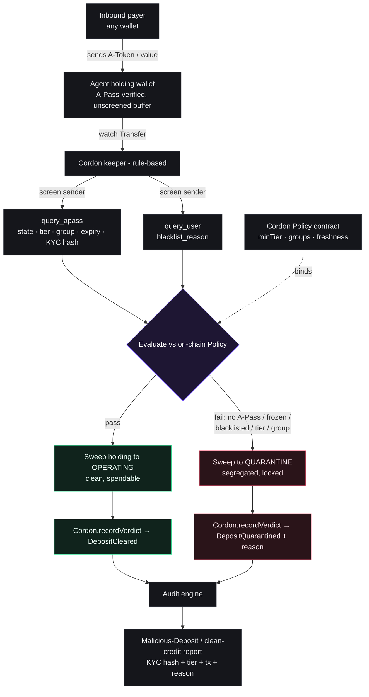

# Cordon — Architecture

Cordon is the **inbound compliance firewall** for autonomous agent wallets: every payment an agent *receives* is screened against the institution's on-chain risk policy before it can touch spendable balance. Funds that fail are quarantined; every screen produces a regulator-ready audit record.

## Flow



## Custody model

Cordon does **not** require a contract to custody A-Token. The agent holds three A-Pass-verified wallets:

- **holding** — inbound buffer where received value lands, unscreened
- **operating** — clean, spendable balance
- **quarantine** — segregated, never spent

The keeper routes funds between them (all A-Pass↔A-Pass moves, so transfers pass regardless of how strict the token gating is). The **CordonPolicy contract** carries the institution's policy and the immutable verdict log; it holds no funds.

> **Screen-on-credit, not interception.** You cannot block a push transfer in the mempool. Inbound value lands in holding, is screened, then credited or quarantined. Cordon never claims mempool interception.

If Day-0 confirms a contract address can be A-Pass-registered, an upgrade path turns Cordon into a true vault contract where `release()` reverts unless policy passes — noted, not assumed.

## Keeper state machine (rule-based — no AI in the money path)

```
WATCH    inbound Transfer to the holding wallet (viem watchEvent)
SCREEN   query_apass(sender) + query_user(sender)
EVALUATE against on-chain Policy:
           state == 1 (active), not near expiry (freshnessWindow),
           tier >= minTier, group ∈ allowedGroups, blacklist_reason empty
ROUTE    pass → holding→operating · fail → holding→quarantine
RECORD   CordonPolicy.recordVerdict → DepositCleared | DepositQuarantined
VERIFY   read the event, surface tx + explorer link
```

## On-chain policy & audit anchor — `CordonPolicy.sol`

- **`setPolicy` / `setGroup`** (owner / institution) — the inbound risk policy: `minTier`, `freshnessWindow`, `requireCleanBlacklist`, allowed groups, and the keeper / operating / quarantine addresses.
- **`recordVerdict`** (keeper only) — anchors each screening outcome; the append-only audit log (a duplicate `depositId` reverts).
- **Events** — `PolicyUpdated`, `DepositCleared(…, tier, …)`, `DepositQuarantined(…, reason, …)`, `GroupUpdated`.
- **`attestationHash`** = `keccak(cvRecordId | currentKycHash | tier | state | screenedAt)` — selective disclosure: proves the sender's verified status without putting PII on-chain.

All addresses (ausdc, access_core, apass_address, rpc, chain_id, explorer) are resolved live from `query_chain_config` — never hardcoded.
